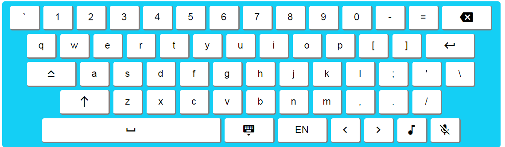

# Virtual Keyboard

You can use this keyboard, if you want to enter text in a text field

Functionality of this keyboard:
* Caps Lock, Shift, Enter, Backspace and Space functionality
* Support for two languages (RU/EN)
* Sound keys
* Backlit keys (when typing on a real keyboard)
* Speech recognition

Open it in your browser - [Virtual Keyboard](https://limonjuice322.github.io/Virtual-Keyboard/)
